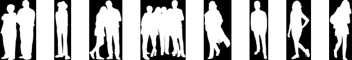
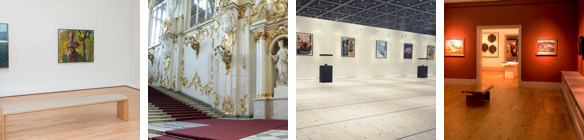
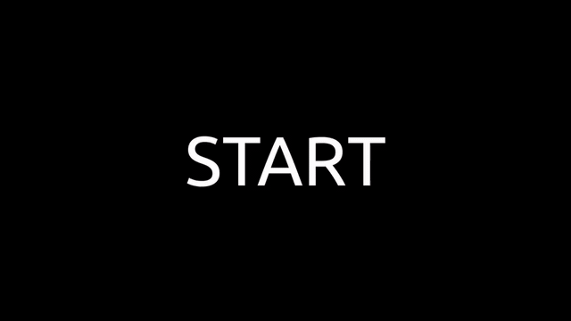
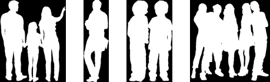
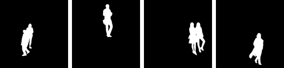
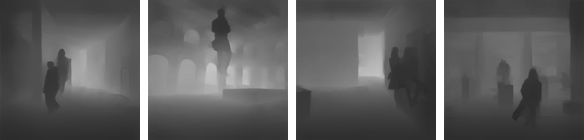

# MOnocular Depth Estimation and SegmenTation (MODEST) Museum Dataset

Link to Dataset: [https://drive.google.com/open?id=15cmtEneHL-Nx8aRE59cfp35Au6qufvIh](https://drive.google.com/open?id=15cmtEneHL-Nx8aRE59cfp35Au6qufvIh)

## Directory Structure

The dataset comprises seven parts, which are stored inside the root directory.

- **bg**: (d) Background images
- **fg**: (d) Foreground images
- **fg_mask**: (d) Mask of foreground images
- **bg_fg**: (d) Images where foregrounds are overlayed on top of backgrounds
- **bg_fg_mask**: (d) Mask of overlayed foreground-background images
- **bg_fg_depth_map**: (d) Depth maps of overlayed foreground-background images
- **file_map.txt**: (f) Relations between files across different parts of the dataset
- **bbox.txt**: (f) Bounding box of foreground in each background

*(d): Directory, (f): File

```bash
dataset
    ├── bg
    |   ├── bg001.jpeg
    |   ├── bg002.jpeg
    |   ├── ...
    |   ├── bg100.jpeg
    ├── fg
    |   ├── fg001.png
    |   ├── fg002.png
    |   ├── ...
    |   └── fg100.png
    ├── fg_mask
    |   ├── fg001_mask.png
    |   ├── fg002_mask.png
    |   ├── ...
    |   └── fg100_mask.png
    ├── bg_fg
    |   ├── bg001_fg001_01.jpeg
    |   ├── bg001_fg001_02.jpeg
    |   ├── ...
    |   └── bg100_fg100_40.jpeg
    ├── bg_fg_mask
    |   ├── bg001_fg001_01_mask.jpeg
    |   ├── bg001_fg001_02_mask.jpeg
    |   ├── ...
    |   └── bg100_fg100_40_mask.jpeg
    ├── bg_fg_depth_map
    |   ├── bg001_fg001_01_depth_map.jpeg
    |   ├── bg001_fg001_02_depth_map.jpeg
    |   ├── ...
    |   └── bg100_fg100_40_depth_map.jpeg
    ├── file_map.txt
    └── bbox.txt
```

## Content Description

### bg

This directory contains **images of museum interiors**. These are called *background images*.
- **Image Size**: 224x224x3
- **Number of Images**: 100
- **Naming Convention**: `bg001.jpeg`, `bg002.jpeg`, ..., `bg100.jpeg`


### fg

This directory contains **images of humans** with transparent background. These are called *foreground images*.
- **Image Height**: 108 (width will depend upon the aspect ratio of each image)
- **Number of Channels**: 4
- **Number of Images**: 100
- **Naming Convention**: `fg001.png`, `fg002.png`, ..., `fg100.png`


### fg_mask

This directory contains **mask of foregrounds**. These are called *foreground masks*.
- **Image Height**: 108
- **Number of Channels**: 1
- **Number of Images**: 100
- **Naming Convention**: `fg001_mask.png`, `fg002_mask.png`, ..., `fg100_mask.png`
  - *Example*: The mask `fg001_mask.png` corresponds to the foreground `fg001.png`



### bg_fg

This directory contains **images where foregrounds are overlayed on backgrounds**. These are called *background-foreground images*.
- **Image Size**: 224x224x3
- **Number of Images**: 400,000
- **Naming Convention**: `bg001_fg001_01.jpeg`, `bg001_fg001_02.jpeg`, ..., `bg100_fg100_40.jpeg`
  - *Example*: The images ranging from `bg001_fg001_01.jpeg` to `bg001_fg001_40.jpeg` correspond to all the variations of the foreground `fg001.png` overlayed on background `bg001.jpeg`


### bg_fg_mask

This directory contains **mask of background-foreground images**. These are called *background-foreground masks*.
- **Image Size**: 224x224x1
- **Number of Images**: 400,000
- **Naming Convention**: `bg001_fg001_01_mask.jpeg`, `bg001_fg001_02_mask.jpeg`, ..., `bg100_fg100_40_mask.jpeg`
  - *Example*: The mask `bg001_fg001_01_mask.jpeg` corresponds to the background-foreground `bg001_fg001_01.jpeg`


### bg_fg_depth_map

This directory contains **depth map of background-foreground images**. These are called *background-foreground depth maps*.
- **Image Size**: 224x224x1
- **Number of Images**: 400,000
- **Naming Convention**: `bg001_fg001_01_depth_map.jpeg`, `bg001_fg001_02_depth_map.jpeg`, ..., `bg100_fg100_40_depth_map.jpeg`
  - *Example*: The depth map `bg001_fg001_01_depth_map.jpeg` corresponds to the background-foreground `bg001_fg001_01.jpeg`


### file_map.txt

This file contains the mapping between images across different parts of the dataset.

- Each line in the file contains 4 entries separated by `\t` where entries are ordered as `background`, `background-foreground`, `background-foreground mask`, `background-foreground depth map`.
- *Example*: The line  
  `bg029 bg029_fg010_18  bg029_fg010_18_mask bg029_fg010_18_depth_map`  
  would mean
  - *Background*: bg029
  - *Background-Foreground*: bg029_fg010_18
  - *Background-Foreground Mask*: bg029_fg010_18_mask
  - *Background-Foreground Depth Map*: bg029_fg010_18_depth_map

To see an overview of the contents of the file, go [here](#dump-file-relations).

### bbox.txt

This file contains the bounding box (bbox) top-left coordinate and bbox size of the foreground in each background image.

- Each line in the file contains 5 entries separated by `\t` where entries are ordered as `background-foreground`, `bbox top left x-coordinate`, `bbox top left y-coordinate`, `bbox width`, `bbox-height`.
- *Example*: The line  
  `bg050_fg084_17.jpeg     90      70      39      108`  
  would mean
  - *Background-Foreground*: bg029_fg010_18
  - *bbox top left x-coordinate*: 90
  - *bbox top left y-coordinate*: 70
  - *bbox top left width*: 39
  - *bbox top left height*: 108

To see an overview of the contents of the file, go [here](#dump-bounding-box-data).

## Statistics

[](https://colab.research.google.com/drive/1Z2Ajg2j0R5tdKZ2G4JGvxgTbgZEpHRsL?usp=sharing)

- Dataset Size: 6.6 GB
- Number of Text Files: 2
- Number of Images: 1,200,100
- Image Types and their Statistics
  - **Backgrounds**
    - Image Size: 224x224x3
    - Number of Images: 100
    - Mean: (0.40086, 0.46599, 0.53281)
    - Standard Deviation: (0.25451, 0.24249, 0.23615)
  - **Background-Foregrounds**
    - Image Size: 224x224x3
    - Number of Images: 400,000
    - Mean: (0.41221, 0.47368, 0.53431)
    - Standard Deviation: (0.25699, 0.24577, 0.24217)
  - **Background-Foreground Masks**
    - Image Size: 224x224x1
    - Number of Images: 400,000
    - Mean: 0.05207
    - Standard Deviation: 0.21686
  - **Background-Foreground Depth Maps**
    - Image Size: 224x224x1
    - Number of Images: 400,000
    - Mean: 0.2981
    - Standard Deviation: 0.11561

## Dataset Creation

[](https://colab.research.google.com/drive/1FKK9ZgDXV3ogYFlKfbT9tuIsZFHRSVTX)

The dataset was created as follows

- [Download background and foreground images](#download-background-and-foreground-images)
- [Resizing backgrounds](#resizing-backgrounds)
- [Background removal from foregrounds](#background-removal-from-foregrounds)
- [Mask creation for foregrounds](#mask-creation-for-foregrounds)
- [Resizing foregrounds](#resizing-foregrounds)
- [Overlaying foregrounds on backgrounds](#overlaying-foregrounds-on-backgrounds)
- [Depth map](#depth-map)
- [Resizing the entire dataset](#resizing-the-entire-dataset)
- [Dump file relations](#dump-file-relations)
- [Dump bounding box data](#dump-bounding-box-data)

### Download background and foreground images

- Create the directories `bg` and `fg` inside the **root directory**.
- Search and download **100 images** from the web showing museums from the inside. Crop these images in an aspect ratio of `1:1` (square). Keep these images in the `bg` directory.
- Search and download **100 images** from the web containing humans. (It is preferable to download images with a solid background. This will make the background removal from these images easier). Keep these images in the `fg` directory.

### Resizing backgrounds

All the background images are resized into a fixed size of `704x704`. This is done for the following reasons

- If the size of backgrounds is fixed, then the foregrounds which will be overlayed on top of the backgrounds can be of fixed size as well. This will eliminate the need for specifying different foreground size for each background.
- The DenseDepth model (which will be used later) requires all the input images to be of same dimension.

**Reason for choosing initial background size of 704x704**:  
This shape was chosen because during our trials we found that this was the minimum shape at which DenseDepth gave very accurate depth maps.  
Later, after all the images and depth maps are created, all the images will be resized to a size of 224x224.

#### Sample background images



### Background removal from foregrounds

All the downloaded foreground images should have a transparent background in order to overlay them on top of background images.

For removing backgrounds, the open-source software **GIMP - GNU Image Manipulation Program** can be used. Steps for removing background using GIMP has been shown below:



Images are exported as PNG because it allows the image to have a transparent background.

#### Sample foreground images


### Mask creation for foregrounds

#### Concept of alpha channel

- There is an alpha channel in the in foreground images which specifies the opacity for a color. After adding transparent backgrounds to the images in _GIMP_, the alpha parameter ranges from 0 (fully transparent) to 255 (fully opaque).
- The alpha channel in foreground images has pixel value set to 0 wherever transparency is present.
- After adding transparency to images in _GIMP_, the background color of the image is set to white (i.e. pixels values in RGB channel are equal to 255) which is hidden with the help of the alpha channel.

#### Creating mask

- The pixels in the foreground image are set to 255 (white) where the object is present and rest of the pixels (background) are set to 0 (black).
- The non-zero values in the alpha channel are set to 255, this ensures full opaqueness of the object mask in the image.

#### Sample foreground masks



### Resizing foregrounds

All the foreground images are resized to have a fixed height of 340.  
Since the background image is of fixed dimension 704x704, the foreground that has to be overlayed on top of it should be in proportion.
Also in order to maintain the aspect ratio of the foreground, we find the corresponding width with respect to a height of 340 and then resize it to (340, new_width).

**Reason for choosing foreground height as 340**:  
After many attempts of overlaying different foregrounds on different backgrounds, we found 340 to be the most optimum height for the foregrounds with respect to the background size of 704x704.

### Overlaying foregrounds on backgrounds

Foregrounds are overlayed on backgrounds to create background-foreground images. A corresponding mask of background-foreground image will also be created.

#### Creating a single image and its mask

1. Find a random location (x,y) on the background image. Make sure that x ranges between `[0, background_height-foreground_height]` and y ranges between `[0, background_width-foreground_width]`. This ensures that foreground is always completely inside the background.
1. Place the foreground image on top of the background image with (x,y) as the top left corner. This will be the background-foreground image.
1. Calculate the bounding box values for this image
    - Current image size is 704x704 and the final image size will be 224x224, so the bounding box values will be calculated with respect to the final image size
    - Calculate the scale ratio = 224 / 704
    - Multiply the x, y, foreground width and height values with the scale ratio to obtain the bounding box values
1. Place the mask of the foreground on a black image that has same shape as that of the background at (x,y) as the top left corner. This will be the mask for the background-foreground image.
1. Since the mask is in grayscale, the number of channels in these images is reduced to 1 to save storage space.

#### Dataset Creation

Now for each background-foreground pair:

- Repeat the steps [above](#creating-a-single-image-and-its-mask) for 20 different locations.
- Flip the foreground and its mask horizontally and again repeat the steps [above](#creating-a-single-image-and-its-mask) for 20 different locations.
- Store all the bounding box values for each image in a list and dump them in a file.

#### Images created in this step

- Number of foreground images = 100
- Number of background images = 100
- Overlaying foreground on 20 different locations: 100x100x20 = 200,000
- Overlaying horizontally flipped foreground on 20 different locations: 100x100x20 = 200,000
- Total overlayed images = 400,000

Each of *background-foreground*, *background-foreground mask* and *background-foreground depth map* will have 400,000 images.

Thus, total number of images in the dataset is **1,200,000**.

#### Sample background-foreground images


#### Sample background-foreground masks



### Depth map

To create the monocular depth estimation map of the background-foreground images, we use pretrained DenseNet-201. Implementation for the model inference was referenced from [this](https://github.com/ialhashim/DenseDepth) repository.

Since the depth maps are in grayscale, the number of channels for these images is reduced to 1 to save storage space.

Note: Since we don't have a DepthCam, we rely on a pretrained DenseNet-201 model to generate depth maps.

#### Sample background-foreground depth maps



### Final resize of the dataset

Since the dimension 704x704 is quite big and it will take huge amount of time to train so we resize the entire dataset which consists of background images, background-foreground images, background-foreground mask and background-foreground depth maps to 224x224 which is big enough to get a good accuracy as well as train faster.

The background images have been resized by a factor of 3.1428 (704 / 224), so the foreground images would have to be resized as well. The new size of foreground images becomes 108 (340 / 3.1428).

### Dump file relations

The relationships between various parts of the dataset are dumped in a file named `file_map.txt`. The contents of the file are as follows:
```
bg001 bg001_fg001_01  bg001_fg001_01_mask bg001_fg001_01_depth_map
bg001 bg001_fg001_02  bg001_fg001_02_mask bg001_fg001_02_depth_map
...
bg029 bg029_fg010_18  bg029_fg010_18_mask bg029_fg010_18_depth_map
...
bg100 bg100_fg100_40  bg100_fg100_40_mask bg100_fg100_40_depth_map
```

### Dump bounding box data

The bounding box data for each background-foreground image is dumped in a file named `bbox.txt`. The contents of the file are as follows:
```
bg001_fg001_01.jpeg     123     113     35      108
bg001_fg001_02.jpeg     101     81      35      108
...
bg050_fg084_17.jpeg     90      70      39      108
...
```
The steps for calculation of bounding box for each image is described in [this](#overlaying-foregrounds-on-backgrounds) section.

